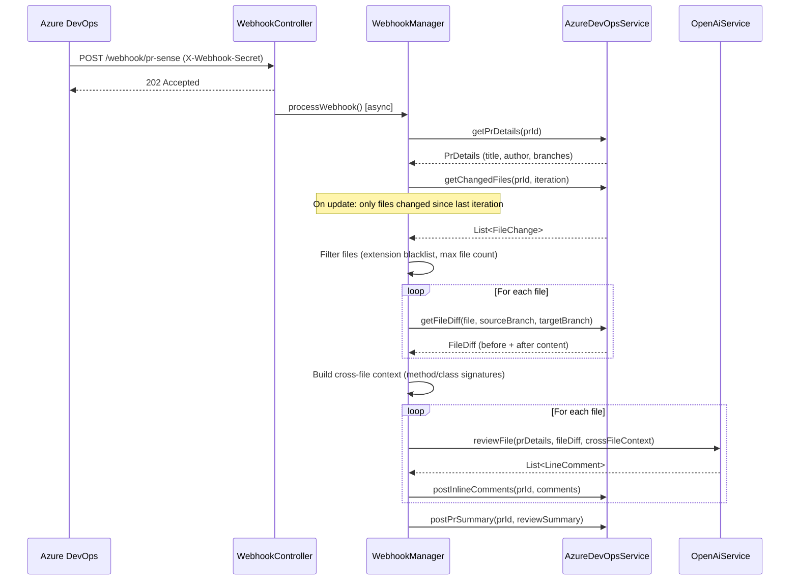

# PRSense

> AI-powered pull request review engine for Azure DevOps — listens for webhook events, analyzes code diffs with OpenAI GPT, and posts contextual inline comments directly into your PRs.

---

## Table of Contents

- [What It Does](#what-it-does)
- [High-Level Architecture](#high-level-architecture)
- [Request Flow](#request-flow)
- [Core Modules](#core-modules)
- [Key Design Decisions](#key-design-decisions)
- [Configuration](#configuration)
- [Running Locally](#running-locally)
- [Azure DevOps Webhook Setup](#azure-devops-webhook-setup)
- [MCP Server & Agentic Review](#mcp-server--agentic-review)
- [Extending PRSense](#extending-prsense)
- [Contributing](#contributing)

---

## What It Does

PRSense integrates with Azure DevOps as a webhook receiver. When a PR is opened or updated, Azure DevOps sends a webhook event to PRSense. PRSense then:

1. Fetches the full diff for each changed file
2. Sends each file's before/after content to OpenAI GPT with a structured prompt
3. Posts line-level review comments and a PR-level summary back to the PR

The result is immediate, first-pass review feedback — logic errors, security issues, performance problems, missing edge cases — before any human reviewer looks at the PR. Human reviewers can then focus on higher-level concerns.

**What PRSense catches:**
- Logic errors and incorrect semantic flows (e.g. wrong enum values, broken conditions)
- Security issues (injection, missing validation, exposed secrets)
- Performance problems (N+1 queries, inefficient patterns)
- Omission bugs (dropped annotations, removed null checks, missing interface implementations)
- Soft-delete bypass vulnerabilities
- Cross-file inconsistencies (interface/implementation mismatches)

---

## High-Level Architecture

PRSense is a Spring Boot 3.3.5 application (Java 17) structured around three layers: a thin REST controller, an orchestration manager, and two external service clients.

```
┌──────────────────────────────────────────────────────────────┐
│  Azure DevOps                      OpenAI                    │
│  (webhook source, PR/diff API)     (GPT chat completions)    │
└───────────────┬──────────────────────────┬───────────────────┘
                │ POST /webhook/pr-sense   │
                ▼                          │
┌──────────────────────────┐              │
│  WebhookController       │              │
│  • Validates secret      │              │
│  • Returns 202 async     │              │
└──────────┬───────────────┘              │
           │ async (thread pool)          │
           ▼                              │
┌──────────────────────────┐              │
│  WebhookManagerImpl      │              │
│  (orchestration)         │              │
│  • Event filtering       │              │
│  • File filtering        │              │
│  • Review loop           │              │
│  • Comment aggregation   │              │
└───────┬──────────┬───────┘              │
        │          │                      │
        ▼          ▼                      ▼
┌────────────┐  ┌───────────────────────────┐
│  AzureDevOps│  │  OpenAiService            │
│  Service    │  │  • Builds structured prompt│
│  • PR details│ │  • Calls GPT API          │
│  • File diffs│ │  • Parses JSON response   │
│  • Post     │  └───────────────────────────┘
│    comments │
└────────────┘
```

**Layer responsibilities:**

| Layer | Class | Responsibility |
|---|---|---|
| Controller | `WebhookController` | Receives webhook, validates secret, dispatches async task |
| Orchestration | `WebhookManagerImpl` | Drives the entire review flow end-to-end |
| Service | `AzureDevOpsServiceImpl` | All Azure DevOps REST API calls |
| Service | `OpenAiServiceImpl` | Prompt construction, OpenAI API calls, response parsing |
| Utility | `CrossFileContextBuilder` | Extracts method/class signatures for cross-file awareness |
| Utility | `DiffUtil` | Generates unified diffs using java-diff-utils |
| Utility | `LanguageUtil` | Maps file extensions to language name + Markdown fence |

---

## Request Flow

### PR Created or Updated



### AI Review of a Single File

The prompt sent to GPT is structured in layers:

1. **System prompt** — defines the reviewer persona, output format (JSON array), and general rules; injects language-specific rules for Java files
2. **PR context** — title, description, and author so the AI understands intent
3. **Before content** — full original file with line numbers
4. **Unified diff** — what changed, generated by `DiffUtil`
5. **After content** — full modified file with line numbers (anchors line references in comments)
6. **Cross-file context** — method/class signatures from other changed files

GPT responds with a JSON array of comment objects. Each comment includes a line number, severity (`HIGH`/`MEDIUM`/`LOW`), the review text, and an optional code suggestion. `OpenAiServiceImpl` extracts this JSON, maps it to `LineComment` objects, and filters out any malformed entries.

### Comment Posting

For each `LineComment`:
- PRSense attempts to post an inline thread at the exact line using the Azure PR Threads API
- If that fails (e.g. the position isn't valid for Azure's diff), it falls back to a file-level comment
- Severity is prefixed as an emoji: `HIGH` → 🔴, `MEDIUM` → 🟡, `LOW` → 🔵

After all inline comments are posted, PRSense posts a PR-level summary comment with:
- Issue counts by severity
- A file-by-file breakdown
- A verdict: reject if there are any HIGH issues or more than two MEDIUM issues; otherwise, approve with comments

---

## Core Modules

### `WebhookManagerImpl`

The heart of PRSense. It filters events (only `git.pullrequest.created` and `git.pullrequest.updated` are processed), controls which files get reviewed, and sequences the entire review loop. Most behavioral tuning (max files, file size limits, which extensions to skip) flows through this class via `ReviewProperties`.

### `AzureDevOpsServiceImpl`

Wraps all Azure DevOps REST API v7.1 interactions using `RestTemplate`. Handles:
- Fetching PR metadata, file change lists, and iteration history
- Retrieving raw file content from both source and target branches (items API)
- Creating PR threads (inline and file-level)
- Basic auth with a Personal Access Token

### `OpenAiServiceImpl`

Handles all OpenAI interactions. The system prompt is carefully tuned to produce structured JSON output and catch specific classes of bugs. It detects the file's language via `LanguageUtil` and injects language-specific rules — currently, Java gets additional checks for soft-delete bypass, annotation drift, and semantic flow correctness. The model, token limit, and temperature are all configurable.

### `CrossFileContextBuilder`

Extracts method signatures, class declarations, and interface definitions from all changed files using regex patterns. This context is appended to each file's review prompt so GPT can reason about cross-file concerns — for example, whether an interface method was removed but its implementations weren't updated, or whether a new method introduces an N+1 query pattern.

### `ReviewSummary` (model)

Aggregates `LineComment` objects across all reviewed files, counts by severity, and renders the final Markdown summary comment. The verdict logic lives here.

---

## Key Design Decisions

**Async dispatch on webhook receipt**

Azure DevOps expects a sub-second HTTP response from webhooks. Reviewing a PR can take 10–30 seconds depending on file count and OpenAI latency. PRSense returns `202 Accepted` immediately and processes the review on a `ThreadPoolTaskExecutor` (5 core threads, 10 max, queue capacity 50) to avoid timeout failures.

**Review only changed files on PR update**

On `git.pullrequest.updated` events, PRSense fetches only the files modified since the last reviewed iteration rather than re-reviewing the entire PR. This avoids duplicate comments and keeps AI token costs proportional to the size of each push.

**Fallback from line-level to file-level comments**

Azure's inline comment API is strict about position validity. Rather than failing silently or crashing, PRSense retries failed inline comments as file-level comments. Developers still get the feedback; it just isn't anchored to a specific line.

**Cross-file context as a first-class concern**

Simple file-by-file review misses bugs that span multiple files. `CrossFileContextBuilder` extracts signatures from all changed files and includes them in every file's prompt. This is a lightweight but effective way to give GPT visibility into related changes without sending entire file contents for context.

**Configurable file filtering**

Config files (`.yml`, `.yaml`, `.xml`, `.json`, `.sql`, `.md`, `.properties`) are skipped by default — they rarely benefit from code review and waste token budget. The extension blacklist and max file count are configurable so teams can tune this to their workflow.

**Structured JSON output from GPT**

The system prompt instructs GPT to respond only with a JSON array. `OpenAiServiceImpl` extracts and parses this JSON from the response, with validation to filter out any entries missing required fields. This makes the AI output machine-readable and avoids fragile regex parsing of natural language.

---

## Configuration

PRSense is configured via `application.yaml`. All sensitive values should be injected via environment variables in production.

```yaml
server:
  port: 8081

azure:
  devops:
    org: ${AZURE_DEVOPS_ORG}
    pat: ${AZURE_DEVOPS_PAT}
    base-url: https://dev.azure.com/${AZURE_DEVOPS_ORG}

openai:
  api-key: ${OPENAI_API_KEY}
  model: gpt-4o          # any OpenAI chat model
  max-tokens: 4096
  temperature: 0.3       # lower = more deterministic output

webhook:
  secret: ${WEBHOOK_SECRET}  # must match the secret set in Azure DevOps webhook config

review:
  max-files: 15              # max files to review per PR event
  max-lines: 300             # max line diff size per file
  skip-extensions:           # file types to skip
    - .yml
    - .yaml
    - .xml
    - .sql
    - .json
    - .md
    - .txt
    - .properties
  thread-pool-size: 5
```

| Property | Description |
|---|---|
| `azure.devops.org` | Azure DevOps organization name |
| `azure.devops.pat` | PAT with `Code (Read)` and `Pull Request Threads (Read & Write)` scopes |
| `openai.api-key` | OpenAI API key |
| `openai.model` | GPT model to use (`gpt-4o` recommended) |
| `openai.temperature` | Lower values produce more consistent output |
| `webhook.secret` | Shared secret validated on every inbound webhook |
| `review.max-files` | Cap on files reviewed per event (cost control) |
| `review.max-lines` | Files with diffs larger than this are skipped |
| `review.skip-extensions` | Extensions exempt from review |

---

## Running Locally

**Prerequisites:**
- Java 17+
- Maven 3.8+ (or use the included `mvnw` wrapper)
- Azure DevOps org with a repo and PAT
- OpenAI API key
- A tunnel tool (e.g. [ngrok](https://ngrok.com)) to expose the local server to Azure webhooks

**Steps:**

```bash
# Clone the repo
git clone https://github.com/your-org/PRSense.git
cd PRSense

# Set environment variables (or edit application.yaml directly for local dev)
export AZURE_DEVOPS_ORG=your-org
export AZURE_DEVOPS_PAT=your-pat
export OPENAI_API_KEY=your-key
export WEBHOOK_SECRET=your-secret

# Run
./mvnw spring-boot:run

# Server starts on port 8081
# Webhook endpoint: POST http://localhost:8081/webhook/pr-sense
```

---

## Azure DevOps Webhook Setup

1. Go to **Project Settings → Service Hooks → Create Subscription**
2. Select **Web Hooks**
3. Set the trigger to **Pull request created** (repeat for **Pull request updated**)
4. Set the URL to your PRSense server: `https://<your-host>/webhook/pr-sense`
5. Add a custom header: `X-Webhook-Secret: <your-secret>` matching `webhook.secret` in your config
6. Save and test with a new PR

---

## MCP Server & Agentic Review

### Architecture

PRSense exposes a Model Context Protocol (MCP) server alongside its existing review API. The review agent now uses Spring AI's `ChatClient` with all 10 MCP tools attached, enabling the LLM to autonomously query the repository knowledge base before generating a review.

```
PR Diff arrives
      ↓
AgentReviewServiceImpl
      ↓  (sends diff + 10 tool definitions to OpenAI)
  ChatClient.prompt()
    .toolCallbacks(10 tools)
    .call()
      ↓
  LLM: "I need more context — calling retrieve_context"
      ↓  Spring AI auto-executes tool
  ContextRetrievalTool → CodeSearchToolService → PGVector
      ↓  result fed back to LLM
  LLM: "calling find_references for UserService"
      ↓
  ReferenceSearchTool → CodeChunkRepository
      ↓
  LLM: finish_reason=stop → returns JSON review comments
      ↓
Comments posted to Azure DevOps
```

### 10 Available Tools

| Tool name | Purpose |
|---|---|
| `retrieve_context` | One-stop PR context aggregation (call this first) |
| `search_code` | Semantic vector search over indexed repository code |
| `get_file` | Retrieve file content by path |
| `find_references` | All usages of a symbol across the codebase |
| `find_implementations` | All classes implementing a given interface |
| `get_class_hierarchy` | Inheritance tree for a class |
| `get_related_code` | Related services, repos, DTOs for a class |
| `analyze_impact` | Blast radius of changing a class |
| `search_review_history` | Past review records for pattern matching |
| `search_similar_prs` | Similar previously-reviewed PRs |

### Tool Registration Lifecycle

At application startup, `McpToolRegistry` creates a `ToolCallbackProvider` bean containing all 10 tools. This bean is used in two places:

1. **Spring AI MCP Server** — auto-discovered and exposed over HTTP/SSE at `/mcp` for external clients (Claude Desktop, Cursor, etc.)
2. **`AgentReviewServiceImpl`** — injected directly so the internal `ChatClient` sends tool definitions to OpenAI with every review request

### Verifying MCP Tool Usage

**The review is truly agentic if you see these log patterns in order:**

```
# 1. Startup — tools registered
INFO  c.c.p.mcp.registry.McpToolRegistry : MCP tool registered — name: 'retrieve_context', description length: N chars
INFO  c.c.p.mcp.registry.McpToolRegistry : MCP tool registered — name: 'search_code', ...
...  (10 lines total)
INFO  c.c.p.mcp.registry.McpToolRegistry : MCP tool registry initialized — 10 tool(s) registered and attached to ChatClient

# 2. Review dispatch — tools attached to request
INFO  c.c.p.s.impl.AgentReviewServiceImpl : Agent review dispatched — file: ..., 10 tools attached, repository: 'my-service'

# 3. Tool invocation — THIS proves MCP is active
INFO  c.c.p.m.s.impl.ToolMetricsServiceImpl : Tool execution started — tool: retrieve_context, context: my-service
INFO  c.c.p.m.s.impl.ToolMetricsServiceImpl : Tool execution completed — tool: retrieve_context, context: my-service, duration: 340ms

# 4. Agent response
INFO  c.c.p.s.impl.AgentReviewServiceImpl : Agent review response received — file: ..., duration: 8200ms
```

**The review is NOT agentic if you see:**
```
# Old flow — direct OpenAI call, no tools
INFO  c.c.p.service.impl.OpenAiServiceImpl : Requesting AI review — file: ...
# No ToolMetricsServiceImpl lines
```

### MCP Debugging Checklist

Run through this checklist if tools are not being invoked:

- [ ] **Tool registration logs present at startup?**
  Look for 10× `MCP tool registered — name:` lines. If missing, `McpToolRegistry` bean failed to initialize.

- [ ] **`spring.ai.openai.api-key` configured?**
  `ChatClient.Builder` needs the OpenAI key. Check `application.yaml` / env var `OPENAI_API_KEY`.

- [ ] **`AgentReviewServiceImpl` started?**
  Look for `Agent review dispatched — ... tools attached` in logs. If missing, `AgentReviewService` bean failed.

- [ ] **`ToolCallbackProvider` bean present?**
  Spring context should contain one `ToolCallbackProvider` bean. If there are zero or two, tool attachment will fail silently or throw.

- [ ] **Repository indexed before review?**
  MCP tools that query PGVector (`search_code`, `retrieve_context`) return empty results if the repository hasn't been indexed via `POST /index/repository`. Index first, then trigger review.

- [ ] **`repository` parameter matches index name?**
  The `repository` sent to tools equals the `projectName` from the review request. This must match the `repositoryName` used when indexing (`POST /index/repository { "repositoryName": "..." }`).

- [ ] **Duration reasonable?**
  A prompt-only review takes 2–5 seconds per file. An agentic review with tool calls takes 8–30+ seconds. Short duration = no tool calling occurred.

### Common Failure Scenarios

| Symptom | Cause | Fix |
|---|---|---|
| No `MCP tool registered` at startup | `McpToolRegistry` bean failed | Check Spring context logs for bean creation errors |
| `Agent review dispatched` but no tool logs | LLM chose not to call tools | Simple files don't trigger tool calls; check with complex PRs |
| `Agent review dispatched` then error | `ChatClient` misconfigured | Verify `spring.ai.openai.api-key` is set |
| Tools invoked but empty results | Repository not indexed | Run `POST /index/repository` first — see indexing guide below |
| `Tool execution started` but failure | PGVector/DB unavailable | Check PostgreSQL connection and pgvector extension |
| `response_length: 2` / 0 comments | Agent received no context + weak prompt | Repository not indexed; agent now reviews diff regardless (post-fix) |
| Review returns `[]` unexpectedly | Tools returned 0 results and prompt told agent to wait for context | Fixed: agent now performs diff-first review even when tools return empty |

### Indexing Lifecycle (Required Before MCP Retrieval Works)

MCP tools that use PGVector (`search_code`, `retrieve_context`, `get_related_code`, `analyze_impact`) return **0 results** until the repository is indexed. This is the most common cause of empty reviews.

**Step 1 — Index the repository:**
```bash
POST /index/repository
{
  "repositoryName": "CustomerProject",   # must match projectName in review requests
  "repositoryPath": "/path/to/cloned/repo"
}
```

**Step 2 — Verify indexing:**
```bash
GET /index/status?repositoryName=CustomerProject
# Expected: totalChunks > 0
```

**Step 3 — Confirm search works:**
```bash
GET /search/code?repositoryName=CustomerProject&query=UserService
# Expected: resultCount > 0
```

**Step 4 — Trigger a review:**
```bash
POST /reviews/trigger
{
  "repositoryId": "repo-123",
  "pullRequestId": 456,
  "projectName": "CustomerProject"   # must match repositoryName used in Step 1
}
```

**Critical requirement:** `projectName` in the review request MUST equal `repositoryName` used in `POST /index/repository`. If they differ, all MCP tool queries return 0 results.

### Diagnosing 0-Comment Reviews

If a review completes with 0 comments on a PR with real changes:

1. **Check `response_length`** — if it shows `2`, the agent returned `[]`. Likely cause: empty tool context.
2. **Look for WARN** — `Vector search returned 0 results -- repository: 'X'. Repository may not be indexed.` confirms the root cause.
3. **Check indexing** — `GET /index/status?repositoryName=X` should show `totalChunks > 0`.
4. **Check name match** — `projectName` in the review must equal `repositoryName` used during indexing.

**Sample successful retrieval log pattern (what you want to see):**
```
INFO  AgentReviewServiceImpl  : Agent review dispatched — file: 'UserService.java', 10 tools attached
INFO  ToolMetricsServiceImpl  : Tool execution started — tool: retrieve_context, context: CustomerProject
INFO  CodeSearchToolServiceImpl: Vector search executed — query: 'UserService business logic implementation'
INFO  CodeSearchToolServiceImpl: Vector search returned 5 result(s) — repository: 'CustomerProject'
INFO  ToolMetricsServiceImpl  : Tool execution completed — tool: retrieve_context, duration: 820ms
INFO  AgentReviewServiceImpl  : Agent review response received — duration: 9340ms, response_length: 187
INFO  AgentReviewServiceImpl  : Agent parsed 3 valid comment(s) from 3 total for: 'UserService.java'
```

**Sample failed retrieval log pattern (what to look for):**
```
WARN  CodeSearchToolServiceImpl: Vector search returned 0 results -- repository: 'CustomerProject'.
                                  Repository may not be indexed. Run POST /index/repository first.
WARN  AgentReviewServiceImpl  : Agent returned minimal response ('[]') for 'UserService.java'.
                                  Verify repository 'CustomerProject' is indexed.
INFO  ReviewManagerImpl       : Review REV-XXXXX completed -- 0 file(s), 0 comment(s)
```

### External MCP Client Access

External tools (Claude Desktop, Cursor, etc.) can connect to PRSense's MCP server at:

```
http://localhost:8081/mcp/sse
```

This exposes the same 10 tools for use in any MCP-compatible client. Useful for interactive repository exploration during development.

---

## Azure DevOps Repository Indexing

### Architecture

PRSense fetches source files directly from Azure DevOps — no local clone required. Once a repository is registered, PRSense automatically indexes it and keeps it current through two complementary sync strategies.

```
Developer pushes code
       ↓
Azure DevOps git.push webhook → POST /webhook/pr-sense
       ↓
RepositorySyncManager.syncByAzureRepoId()
       ↓  (async, thread pool)
RepositorySyncService.incrementalSync()
       ↓
Azure DevOps diff API  →  only changed .java files
       ↓
JavaCodeParser  →  ParsedSymbol list
       ↓
CodeChunker  →  CodeChunkEntity list
       ↓
EmbeddingService  →  OpenAI text-embedding-3-small
       ↓
CodeChunkRepository  →  PGVector (code_chunks table)
       ↓
MCP tools (search_code, retrieve_context, ...)
```

### Sync Strategies

**Strategy 1 — Webhook (preferred, real-time):**  
Add `git.push` to your Azure DevOps webhook subscriptions alongside the existing PR events. Every push triggers an incremental sync of only the changed files.

**Strategy 2 — Scheduled sync (fallback, every 15 min):**  
Runs automatically for all `INDEXED` or `STALE` repositories. Compares the stored `lastIndexedCommit` against the current HEAD and reindexes changed files.

### Repository Registration

**Register a repository (triggers immediate full index):**
```bash
POST /repositories/register
{
  "projectName": "CustomerProject",
  "repositoryName": "actrios-api",
  "branch": "main"               # optional — auto-detected if omitted
}

# Response 202 Accepted:
{
  "repositoryId": "azure-guid-here",
  "repositoryName": "actrios-api",
  "status": "REGISTERED"
}
```

**Required Azure DevOps PAT scopes:**
- `Code (Read)` — to list files and fetch content
- `Pull Request Threads (Read & Write)` — for review comments

**After registration, the flow is:**
1. `status: REGISTERED` — entry created in `repository_registry`
2. Async full index starts — status transitions to `INDEXING`
3. All `.java` files fetched from Azure DevOps and parsed
4. Embeddings generated and stored in PGVector
5. `status: INDEXED` — MCP tools can now return results
6. On every push: incremental sync updates only changed files

### API Reference

| Endpoint | Description |
|---|---|
| `POST /repositories/register` | Register a repo and trigger initial indexing |
| `POST /repositories/reindex` | Force reindex (`fullRebuild: true` to wipe and rebuild) |
| `GET /repositories` | List all registered repositories with status |
| `GET /repositories/{repositoryId}/status` | Indexing status + commit tracking |
| `GET /repositories/{repositoryId}/metrics` | Chunk count, file count, index version |

### Incremental Indexing — How It Works

PRSense tracks the last indexed commit SHA in the `repository_registry` table. On each sync:

1. Fetch latest HEAD commit from Azure DevOps
2. If HEAD == `lastIndexedCommit` → nothing to do
3. If different → call Azure DevOps diff API for changed files between commits
4. For each changed file:
   - `add` / `edit` / `rename` → delete old chunks, re-parse, re-embed, insert new chunks
   - `delete` → delete chunks for that file from PGVector
5. Update `lastIndexedCommit` and `lastIndexedAt`

### Configuration

```yaml
indexing:
  supported-extensions: [.java]      # file types to index
  max-file-size-bytes: 102400         # skip files >100KB
  sync-enabled: true                  # enable/disable scheduled sync
  sync-interval-ms: 900000            # 15 min between scheduled syncs
  sync-initial-delay-ms: 60000        # 1 min delay before first sync
```

### Required Azure DevOps Webhook Setup (for Strategy 1)

In Project Settings → Service Hooks → Create Subscription:

1. Trigger: **Code pushed** (`git.push` event)
2. URL: `https://<your-host>/webhook/pr-sense`
3. Header: `X-Webhook-Secret: <your-secret>`

Add this alongside the existing PR Created / PR Updated subscriptions.

### Commit Tracking Log Pattern

```
# Full index (after registration)
INFO  RepositorySyncServiceImpl : [IDX-A1B2C3D4] Repository indexing started — repositoryId: 'abc-guid', project: 'CustomerProject', repository: 'actrios-api'
INFO  RepositorySyncServiceImpl : [IDX-A1B2C3D4] Discovered 142 supported file(s) — repositoryId: 'abc-guid'
INFO  RepositorySyncServiceImpl : [IDX-A1B2C3D4] Repository indexing completed — files indexed: 138, files skipped: 4, chunks: 860, commit: fa4021e

# Push-triggered incremental sync
INFO  WebhookController         : Push event received — project: 'CustomerProject', repoId: 'abc-guid' — triggering incremental sync
INFO  RepositorySyncServiceImpl : [SYNC-X9Y8Z7W6] Commit comparison completed — 3 change(s) detected, commitId: 3f8a1b2
INFO  RepositorySyncServiceImpl : [SYNC-X9Y8Z7W6] Modified file reindexed — filePath: '/src/UserService.java', repositoryId: 'abc-guid'
INFO  RepositorySyncServiceImpl : [SYNC-X9Y8Z7W6] New file detected and indexed — filePath: '/src/UserNotificationService.java', repositoryId: 'abc-guid'
INFO  RepositorySyncServiceImpl : [SYNC-X9Y8Z7W6] Chunks removed — filePath: '/src/LegacyService.java', repositoryId: 'abc-guid'
INFO  RepositorySyncServiceImpl : [SYNC-X9Y8Z7W6] Incremental sync completed — added: 1, updated: 1, deleted: 1, chunks: 875, commitId: 3f8a1b2
```

### Troubleshooting

| Symptom | Cause | Fix |
|---|---|---|
| `status: FAILED` after registration | PAT missing `Code (Read)` scope | Generate new PAT with correct scopes |
| `status: INDEXING` for >5 min | Thread pool saturated or file count very large | Check thread pool size, increase `review.thread-pool-size` |
| Incremental sync finds 0 changes | Webhook not configured for `git.push` | Add push event to Azure webhook subscriptions |
| MCP tools still return 0 after registration | `repositoryName` in review doesn't match registered name | Ensure `projectName` in `POST /reviews/trigger` matches `repositoryName` from registration |
| File not indexed | Extension not in `supported-extensions` | Add extension to `indexing.supported-extensions` in yaml |

---

## Extending PRSense

**Add support for a new Git provider (e.g. GitHub)**
- Implement `AzureDevOpsService` interface for the new provider
- Add a new properties class for auth config
- Wire it in via `AppConfig` or Spring profiles

**Add language-specific review rules**
- Edit `OpenAiServiceImpl.buildSystemPrompt()` — the Java-specific rules block is a clear extension point
- Use `LanguageUtil.getLanguage(filePath)` to detect language and inject rules conditionally

**Change the AI model**
- Update `openai.model` in `application.yaml` — no code changes needed

**Tune the verdict thresholds**
- Modify the severity counting logic in `ReviewSummary` — currently: any HIGH or more than two MEDIUMs triggers a reject vote

**Add new file types to review**
- Remove the extension from `review.skip-extensions` in config

---

## Contributing

1. Fork the repository
2. Create a feature branch: `git checkout -b feature/your-feature`
3. Commit your changes: `git commit -m "feat: your feature"`
4. Push and open a pull request

For major changes, open an issue first to discuss the approach.

---

## License

[MIT](LICENSE)
