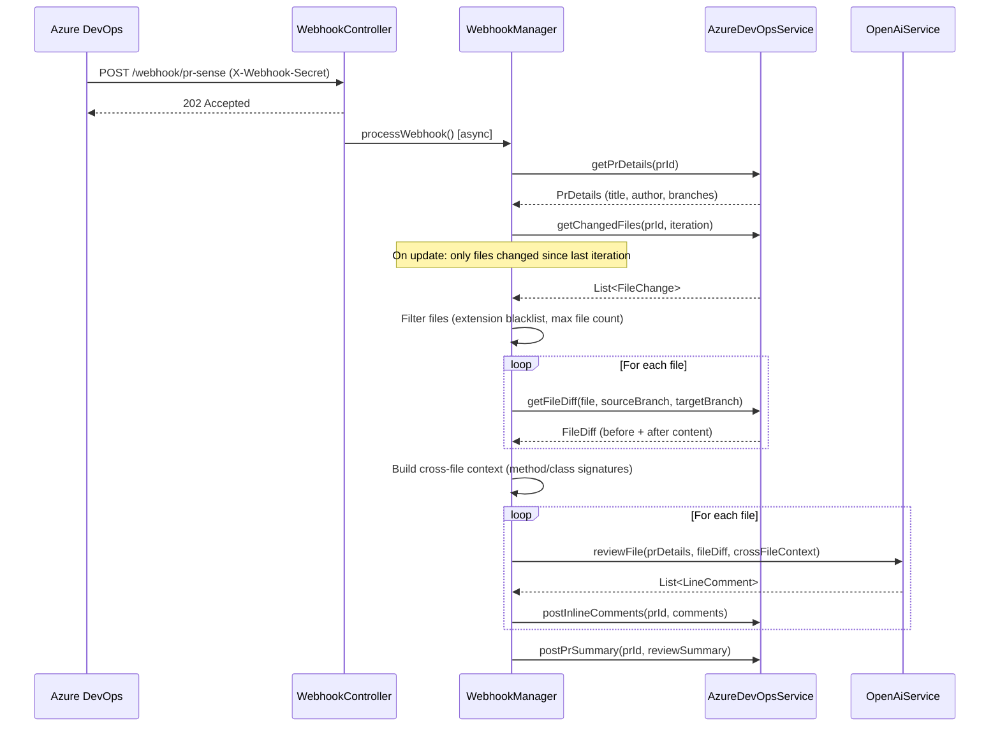

# PRSense

> AI-powered pull request review engine for Azure DevOps — listens for webhook events, analyzes code diffs with OpenAI GPT, and posts contextual inline comments directly into your PRs.

---

## Table of Contents

- [What It Does](#what-it-does)
- [High-Level Architecture](#high-level-architecture)
- [Request Flow](#request-flow)
- [Core Modules](#core-modules)
- [Key Design Decisions](#key-design-decisions)
- [Configuration](#configuration)
- [Running Locally](#running-locally)
- [Azure DevOps Webhook Setup](#azure-devops-webhook-setup)
- [Extending PRSense](#extending-prsense)
- [Contributing](#contributing)

---

## What It Does

PRSense integrates with Azure DevOps as a webhook receiver. When a PR is opened or updated, Azure DevOps sends a webhook event to PRSense. PRSense then:

1. Fetches the full diff for each changed file
2. Sends each file's before/after content to OpenAI GPT with a structured prompt
3. Posts line-level review comments and a PR-level summary back to the PR

The result is immediate, first-pass review feedback — logic errors, security issues, performance problems, missing edge cases — before any human reviewer looks at the PR. Human reviewers can then focus on higher-level concerns.

**What PRSense catches:**
- Logic errors and incorrect semantic flows (e.g. wrong enum values, broken conditions)
- Security issues (injection, missing validation, exposed secrets)
- Performance problems (N+1 queries, inefficient patterns)
- Omission bugs (dropped annotations, removed null checks, missing interface implementations)
- Soft-delete bypass vulnerabilities
- Cross-file inconsistencies (interface/implementation mismatches)

---

## High-Level Architecture

PRSense is a Spring Boot 3.3.5 application (Java 17) structured around three layers: a thin REST controller, an orchestration manager, and two external service clients.

```
┌──────────────────────────────────────────────────────────────┐
│  Azure DevOps                      OpenAI                    │
│  (webhook source, PR/diff API)     (GPT chat completions)    │
└───────────────┬──────────────────────────┬───────────────────┘
                │ POST /webhook/pr-sense   │
                ▼                          │
┌──────────────────────────┐              │
│  WebhookController       │              │
│  • Validates secret      │              │
│  • Returns 202 async     │              │
└──────────┬───────────────┘              │
           │ async (thread pool)          │
           ▼                              │
┌──────────────────────────┐              │
│  WebhookManagerImpl      │              │
│  (orchestration)         │              │
│  • Event filtering       │              │
│  • File filtering        │              │
│  • Review loop           │              │
│  • Comment aggregation   │              │
└───────┬──────────┬───────┘              │
        │          │                      │
        ▼          ▼                      ▼
┌────────────┐  ┌───────────────────────────┐
│  AzureDevOps│  │  OpenAiService            │
│  Service    │  │  • Builds structured prompt│
│  • PR details│ │  • Calls GPT API          │
│  • File diffs│ │  • Parses JSON response   │
│  • Post     │  └───────────────────────────┘
│    comments │
└────────────┘
```

**Layer responsibilities:**

| Layer | Class | Responsibility |
|---|---|---|
| Controller | `WebhookController` | Receives webhook, validates secret, dispatches async task |
| Orchestration | `WebhookManagerImpl` | Drives the entire review flow end-to-end |
| Service | `AzureDevOpsServiceImpl` | All Azure DevOps REST API calls |
| Service | `OpenAiServiceImpl` | Prompt construction, OpenAI API calls, response parsing |
| Utility | `CrossFileContextBuilder` | Extracts method/class signatures for cross-file awareness |
| Utility | `DiffUtil` | Generates unified diffs using java-diff-utils |
| Utility | `LanguageUtil` | Maps file extensions to language name + Markdown fence |

---

## Request Flow

### PR Created or Updated



### AI Review of a Single File

The prompt sent to GPT is structured in layers:

1. **System prompt** — defines the reviewer persona, output format (JSON array), and general rules; injects language-specific rules for Java files
2. **PR context** — title, description, and author so the AI understands intent
3. **Before content** — full original file with line numbers
4. **Unified diff** — what changed, generated by `DiffUtil`
5. **After content** — full modified file with line numbers (anchors line references in comments)
6. **Cross-file context** — method/class signatures from other changed files

GPT responds with a JSON array of comment objects. Each comment includes a line number, severity (`HIGH`/`MEDIUM`/`LOW`), the review text, and an optional code suggestion. `OpenAiServiceImpl` extracts this JSON, maps it to `LineComment` objects, and filters out any malformed entries.

### Comment Posting

For each `LineComment`:
- PRSense attempts to post an inline thread at the exact line using the Azure PR Threads API
- If that fails (e.g. the position isn't valid for Azure's diff), it falls back to a file-level comment
- Severity is prefixed as an emoji: `HIGH` → 🔴, `MEDIUM` → 🟡, `LOW` → 🔵

After all inline comments are posted, PRSense posts a PR-level summary comment with:
- Issue counts by severity
- A file-by-file breakdown
- A verdict: reject if there are any HIGH issues or more than two MEDIUM issues; otherwise, approve with comments

---

## Core Modules

### `WebhookManagerImpl`

The heart of PRSense. It filters events (only `git.pullrequest.created` and `git.pullrequest.updated` are processed), controls which files get reviewed, and sequences the entire review loop. Most behavioral tuning (max files, file size limits, which extensions to skip) flows through this class via `ReviewProperties`.

### `AzureDevOpsServiceImpl`

Wraps all Azure DevOps REST API v7.1 interactions using `RestTemplate`. Handles:
- Fetching PR metadata, file change lists, and iteration history
- Retrieving raw file content from both source and target branches (items API)
- Creating PR threads (inline and file-level)
- Basic auth with a Personal Access Token

### `OpenAiServiceImpl`

Handles all OpenAI interactions. The system prompt is carefully tuned to produce structured JSON output and catch specific classes of bugs. It detects the file's language via `LanguageUtil` and injects language-specific rules — currently, Java gets additional checks for soft-delete bypass, annotation drift, and semantic flow correctness. The model, token limit, and temperature are all configurable.

### `CrossFileContextBuilder`

Extracts method signatures, class declarations, and interface definitions from all changed files using regex patterns. This context is appended to each file's review prompt so GPT can reason about cross-file concerns — for example, whether an interface method was removed but its implementations weren't updated, or whether a new method introduces an N+1 query pattern.

### `ReviewSummary` (model)

Aggregates `LineComment` objects across all reviewed files, counts by severity, and renders the final Markdown summary comment. The verdict logic lives here.

---

## Key Design Decisions

**Async dispatch on webhook receipt**

Azure DevOps expects a sub-second HTTP response from webhooks. Reviewing a PR can take 10–30 seconds depending on file count and OpenAI latency. PRSense returns `202 Accepted` immediately and processes the review on a `ThreadPoolTaskExecutor` (5 core threads, 10 max, queue capacity 50) to avoid timeout failures.

**Review only changed files on PR update**

On `git.pullrequest.updated` events, PRSense fetches only the files modified since the last reviewed iteration rather than re-reviewing the entire PR. This avoids duplicate comments and keeps AI token costs proportional to the size of each push.

**Fallback from line-level to file-level comments**

Azure's inline comment API is strict about position validity. Rather than failing silently or crashing, PRSense retries failed inline comments as file-level comments. Developers still get the feedback; it just isn't anchored to a specific line.

**Cross-file context as a first-class concern**

Simple file-by-file review misses bugs that span multiple files. `CrossFileContextBuilder` extracts signatures from all changed files and includes them in every file's prompt. This is a lightweight but effective way to give GPT visibility into related changes without sending entire file contents for context.

**Configurable file filtering**

Config files (`.yml`, `.yaml`, `.xml`, `.json`, `.sql`, `.md`, `.properties`) are skipped by default — they rarely benefit from code review and waste token budget. The extension blacklist and max file count are configurable so teams can tune this to their workflow.

**Structured JSON output from GPT**

The system prompt instructs GPT to respond only with a JSON array. `OpenAiServiceImpl` extracts and parses this JSON from the response, with validation to filter out any entries missing required fields. This makes the AI output machine-readable and avoids fragile regex parsing of natural language.

---

## Configuration

PRSense is configured via `application.yaml`. All sensitive values should be injected via environment variables in production.

```yaml
server:
  port: 8081

azure:
  devops:
    org: ${AZURE_DEVOPS_ORG}
    pat: ${AZURE_DEVOPS_PAT}
    base-url: https://dev.azure.com/${AZURE_DEVOPS_ORG}

openai:
  api-key: ${OPENAI_API_KEY}
  model: gpt-4o          # any OpenAI chat model
  max-tokens: 4096
  temperature: 0.3       # lower = more deterministic output

webhook:
  secret: ${WEBHOOK_SECRET}  # must match the secret set in Azure DevOps webhook config

review:
  max-files: 15              # max files to review per PR event
  max-lines: 300             # max line diff size per file
  skip-extensions:           # file types to skip
    - .yml
    - .yaml
    - .xml
    - .sql
    - .json
    - .md
    - .txt
    - .properties
  thread-pool-size: 5
```

| Property | Description |
|---|---|
| `azure.devops.org` | Azure DevOps organization name |
| `azure.devops.pat` | PAT with `Code (Read)` and `Pull Request Threads (Read & Write)` scopes |
| `openai.api-key` | OpenAI API key |
| `openai.model` | GPT model to use (`gpt-4o` recommended) |
| `openai.temperature` | Lower values produce more consistent output |
| `webhook.secret` | Shared secret validated on every inbound webhook |
| `review.max-files` | Cap on files reviewed per event (cost control) |
| `review.max-lines` | Files with diffs larger than this are skipped |
| `review.skip-extensions` | Extensions exempt from review |

---

## Running Locally

**Prerequisites:**
- Java 17+
- Maven 3.8+ (or use the included `mvnw` wrapper)
- Azure DevOps org with a repo and PAT
- OpenAI API key
- A tunnel tool (e.g. [ngrok](https://ngrok.com)) to expose the local server to Azure webhooks

**Steps:**

```bash
# Clone the repo
git clone https://github.com/your-org/PRSense.git
cd PRSense

# Set environment variables (or edit application.yaml directly for local dev)
export AZURE_DEVOPS_ORG=your-org
export AZURE_DEVOPS_PAT=your-pat
export OPENAI_API_KEY=your-key
export WEBHOOK_SECRET=your-secret

# Run
./mvnw spring-boot:run

# Server starts on port 8081
# Webhook endpoint: POST http://localhost:8081/webhook/pr-sense
```

---

## Azure DevOps Webhook Setup

1. Go to **Project Settings → Service Hooks → Create Subscription**
2. Select **Web Hooks**
3. Set the trigger to **Pull request created** (repeat for **Pull request updated**)
4. Set the URL to your PRSense server: `https://<your-host>/webhook/pr-sense`
5. Add a custom header: `X-Webhook-Secret: <your-secret>` matching `webhook.secret` in your config
6. Save and test with a new PR

---

## Extending PRSense

**Add support for a new Git provider (e.g. GitHub)**
- Implement `AzureDevOpsService` interface for the new provider
- Add a new properties class for auth config
- Wire it in via `AppConfig` or Spring profiles

**Add language-specific review rules**
- Edit `OpenAiServiceImpl.buildSystemPrompt()` — the Java-specific rules block is a clear extension point
- Use `LanguageUtil.getLanguage(filePath)` to detect language and inject rules conditionally

**Change the AI model**
- Update `openai.model` in `application.yaml` — no code changes needed

**Tune the verdict thresholds**
- Modify the severity counting logic in `ReviewSummary` — currently: any HIGH or more than two MEDIUMs triggers a reject vote

**Add new file types to review**
- Remove the extension from `review.skip-extensions` in config

---

## Contributing

1. Fork the repository
2. Create a feature branch: `git checkout -b feature/your-feature`
3. Commit your changes: `git commit -m "feat: your feature"`
4. Push and open a pull request

For major changes, open an issue first to discuss the approach.

---

## License

[MIT](LICENSE)
